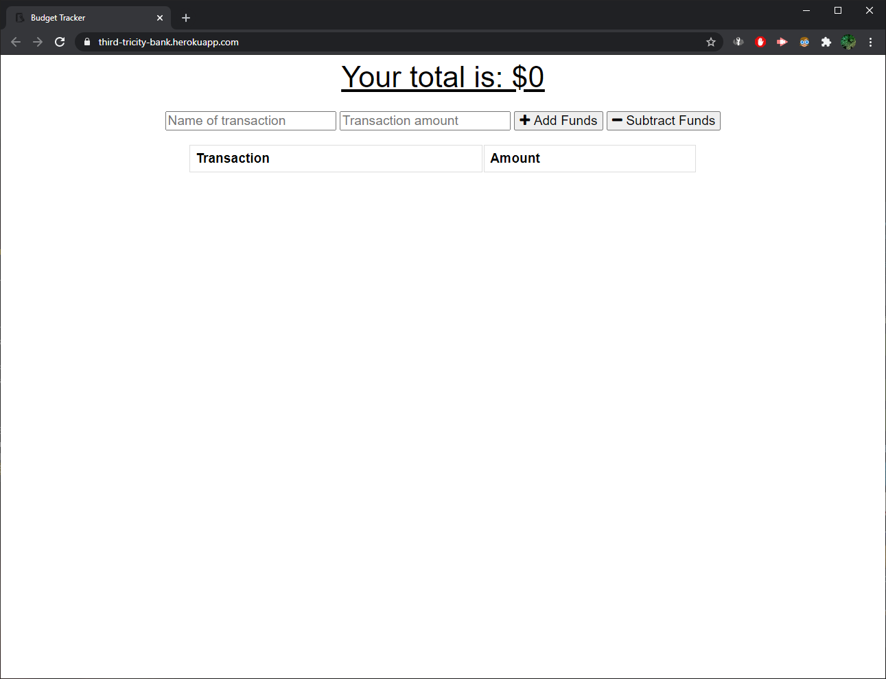

# Third-Tricity-Bank-Account-View

### Author: David Guthmann

github: https://github.com/Dguthmann/Third-Tricity-Bank-Account-View/  
livesite: https://third-tricity-bank.herokuapp.com/  

## List of Contents

TBA
server.js  
package.json  
package-lock.json  
README.md  
LICENSE
screenshot.png
### models  
transaction.js  
### public
db.js
index.html
index.js
manifest.webmanifest
service-worker.js
style.css
##### icons  
icon-192x192.png  
icon-512x512.png  

## Installation
you will need the following additional npms to run this project:  
express  
compression  
mongoose  
morgan  
lite-server  

## Basic Overview of Project

To add a service worker to an account manager. 

## Screenshot of Project

  

## Resources Used

Zach Auerbach for some partials review, and deployment help  

## Further Development Plans

This was a one off assignment, the mongoDB is odd to deploy, will need more practice

## Changelog
2020-11-04: Deployment and bug fixes  
2020-11-03: Importation of base code, writing of service worker, manifest, index.html changes, and ReadME formatting